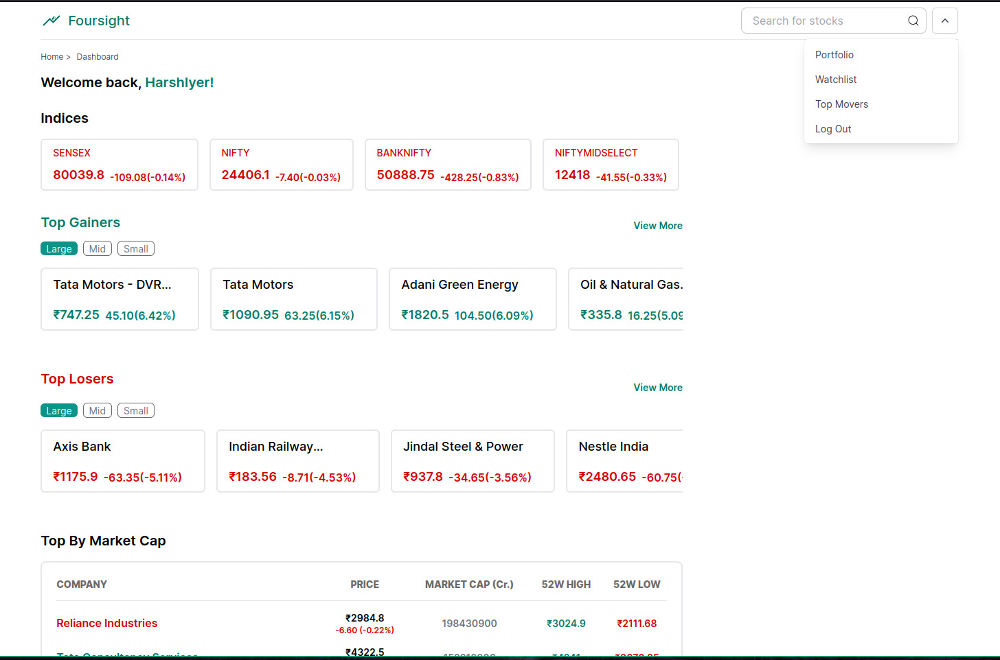
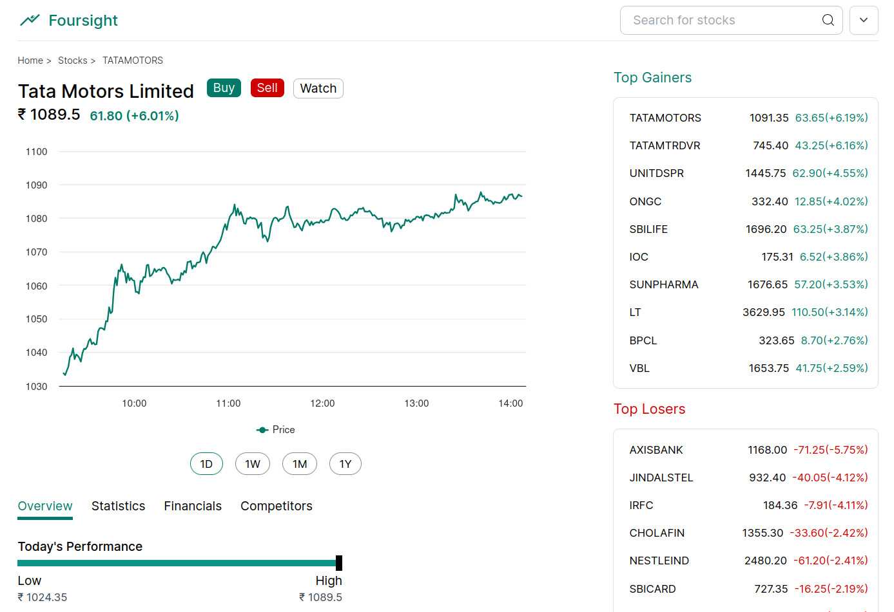

## Foursight

### Your very own Paper Trading & Stock Analysis for the Indian Stock Market

> https://foursight.harshiyer.me

Foursight is a powerful web application designed to empower Indian stock market enthusiasts with a comprehensive paper trading and analysis platform. Practice your trading strategies in a risk-free environment with access to live data for over 2000+ stocks listed on the National Stock Exchange.

### Key Features:

- **Live Data:** Make informed decisions with real-time market updates for a vast selection of Indian stocks.
  
- **Paper Trading:** Simulate real-world trading without risking capital. Track your performance and refine your strategies before investing your hard-earned money.
  
- **Charting:** Get access to historical data for Scrips in interactive and user friendly charts.
  [Image of various chart types and indicators]
- **Portfolio Management:** Build and customize your own virtual portfolios, track your paper trades, and monitor your overall performance.
  
- **Watchlists:** Stay on top of your favorite stocks by creating watchlists.

### Benefits:

- **Risk-Free Learning:** Hone your trading skills in a safe environment. Learn from your mistakes without incurring financial losses.
- **Improved Decision Making:** Gain valuable experience and confidence before entering the live market.
- **Market Research & Analysis:** Analyze historical data, identify trends, and discover new investment opportunities.
- **Track Your Progress:** Monitor your paper trading performance and refine your strategies for long-term success.

### Techstack

> **Built using NextJS for the frontend and Hono for the backend, all hosted on Cloudflare Pages and Workers utilizing D1 and KV.**
